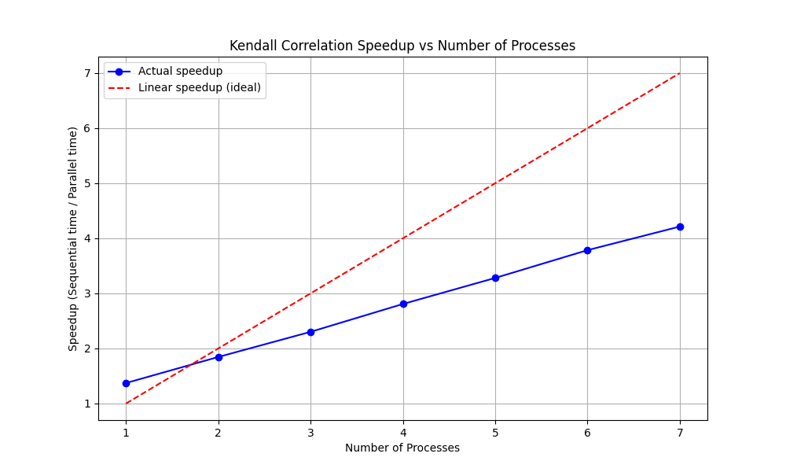

# Kendall Rank Correlation Coefficient Implementation

This project implements both sequential and parallel versions of the Kendall rank correlation coefficient measure.

## Algorithm Description

The Kendall rank correlation coefficient (τ) measures the ordinal association between two measured quantities. It calculates the difference between the number of concordant and discordant pairs, divided by the total number of possible pairs.

## Parallelization Method

The parallel implementation uses Python's multiprocessing to distribute the computation of concordant and discordant pairs across multiple processes. The algorithm is parallelized at the pair comparison level, where different chunks of the data are processed simultaneously.

## Setup and Installation

1. Create a virtual environment (recommended):
```bash
python -m venv venv
source venv/bin/activate  # On Unix/macOS
```

2. Install dependencies:
```bash
pip install -r requirements.txt
```

## Running the Implementation

1. Generate test data:
```bash
python generate_data.py
```

2. Run the sequential version:
```bash
python sequential_kendall.py
```

3. Run the parallel version:
```bash
python parallel_kendall.py
```

4. Generate benchmarks and visualization:
```bash
python benchmark.py
```

## Data

The implementation uses randomly generated data with 100,000 samples. The data is automatically generated when running the scripts.

## Results

The benchmark results and speedup visualization will be generated in the `results` directory. 

## Example Speedup Plot

